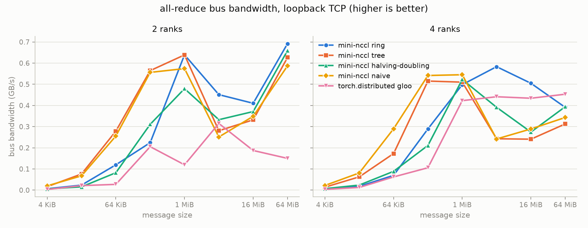
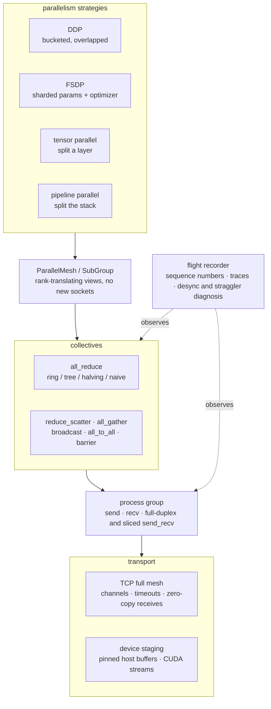
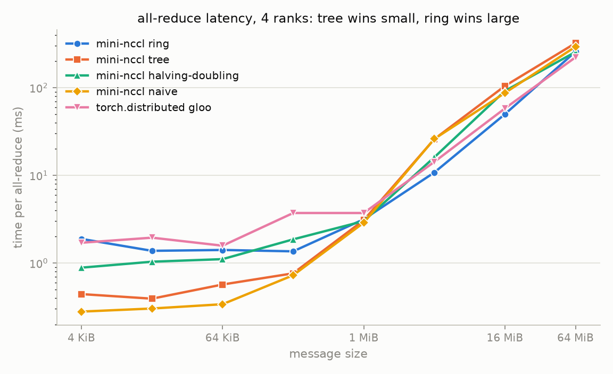
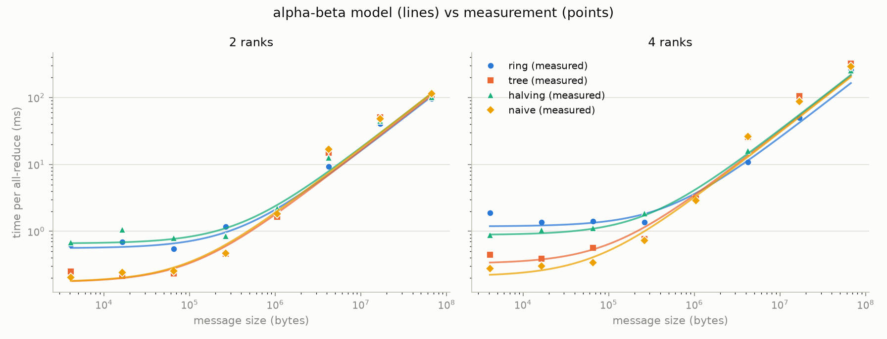

# mini-nccl

[](https://github.com/MrMiniMIze/mini-nccl/actions/workflows/ci.yml)

**Distributed training from first principles.** A small, readable
reimplementation of the machinery inside libraries like NCCL: ring,
binomial-tree, and recursive halving-doubling all-reduce, reduce-scatter,
all-gather, broadcast, and all-to-all, built on nothing but TCP sockets and
PyTorch tensors. On top of those primitives sit **all four** parallelism
strategies written from scratch (data parallel, fully sharded, tensor parallel,
and pipeline) plus the sub-group communicators that compose them into 2D and 3D
meshes, a flight recorder that turns a hung job into a named culprit, and a
character-level GPT whose every gradient byte moves through this library.

No `torch.distributed`, no MPI, no NCCL underneath. The goal is to make the
machinery of distributed training small enough to read in an afternoon and
measured well enough to trust, including the four optimizations that measured
*worse* here and the single reason they all failed the same way.



**If you only read three files:** `collectives.py` for the algorithms,
`ddp.py` for how gradients get reduced while backward is still running, and
`fsdp.py` or `pipeline.py` for how the same primitives carry a model too large
to replicate.
**If you only read three results:** [ring against
gloo](#results), [the tuning ablation](#tuning-not-guessing-the-channel-ablation)
where one optimization measured slower and therefore ships off, and [what
loopback hides](#what-loopback-teaches-and-what-it-hides), where a measured
bandwidth ratio explains all four negative results at once.

## What's inside

| Layer | File | What it does |
|---|---|---|
| Transport | `mini_nccl/transport.py` | Full-mesh TCP rendezvous, N connections per peer ("channels"), zero-copy receives straight into tensor storage, bounded operation timeouts |
| Device path | `mini_nccl/device.py` | Pinned host staging (1.7x on the copy), CUDA streams and events, chunked copy/network pipeline for accelerator tensors |
| Process group | `mini_nccl/process_group.py` | `send` / `recv` / full-duplex `send_recv` / sliced `send_recv`: the primitives everything else is built from |
| Collectives | `mini_nccl/collectives.py` | `all_reduce` (ring, tree, halving-doubling, naive), `reduce_scatter`, `all_gather`, `broadcast`, `all_to_all`, `barrier`, optional narrow wire dtype |
| DDP | `mini_nccl/ddp.py` | Gradient bucketing, grads-as-bucket-views, overlap on a reducer thread, `no_sync()` accumulation |
| FSDP | `mini_nccl/fsdp.py` | Parameter sharding, per-unit all-gather, reduce-scatter gradients, sharded optimizer state, measured memory accounting |
| Tensor parallel | `mini_nccl/tensor_parallel.py` | Column/row parallel linear, head-split attention with fused-QKV row mapping, Megatron's two autograd functions |
| Pipeline parallel | `mini_nccl/pipeline.py` | Depth-split stages, 1F1B and GPipe schedules, deadlock-free fused exchange, measured in-flight depth |
| Mesh | `mini_nccl/mesh.py` | Sub-group communicators as rank-translating views, named dimensions for 2D and 3D composition |
| Interface | `mini_nccl/communicator.py` | The nine-member `Protocol` every collective is written against, so subgroup substitutability is type-checked |
| Flight recorder | `mini_nccl/recorder.py`, `diagnose.py` | Sequence-numbered collective log, Perfetto traces, desync diagnosis |
| Launcher | `mini_nccl/launcher.py` | `mn.run(fn, world_size)`: spawn, rendezvous, collect results, notice dead ranks |
| Examples | `examples/` | Char-level GPT under DDP, FSDP, tensor, pipeline, 2D and 3D meshes, plus a diagnosed hang |
| Benchmarks | `benchmarks/` | nccl-tests-style sweep, tuning ablation, alpha-beta cost model fit, low-precision study, PCIe copy-ceiling analysis |

Every layer is built on the one below it, and nothing reaches past its
neighbour:



## Quickstart

```bash
pip install torch --index-url https://download.pytorch.org/whl/cpu
pip install -e .[dev]

pytest -q                                        # 70 tests, world sizes 1-8
mypy mini_nccl --ignore-missing-imports          # clean across 15 modules

python examples/train_gpt.py --world-size 4 --steps 200 --sample
python examples/train_gpt.py --world-size 4 --steps 200 --fsdp   # sharded
python examples/tensor_parallel_gpt.py --world-size 4            # split layers
python examples/pipeline_gpt.py --world-size 4                   # split depth
python examples/two_dimensional_gpt.py --world-size 4 --tp 2     # tensor x data
python examples/three_dimensional_gpt.py --world-size 8          # all three
python examples/desync_demo.py                   # a hang, diagnosed
python benchmarks/bench_allreduce.py --world-sizes 2,4 --gloo
python benchmarks/bench_ablation.py              # channel + pipeline tuning
python benchmarks/fit_cost_model.py              # alpha-beta fit
python benchmarks/bench_low_precision.py         # bfloat16 wire study
python benchmarks/bench_copy_ceiling.py          # PCIe bandwidth, and the bound it implies
python benchmarks/bench_device.py --channels 1   # device staging vs pipelining
```

The API mirrors `torch.distributed`:

```python
import mini_nccl as mn

def worker(pg):
    t = torch.ones(1024) * pg.rank
    mn.collectives.all_reduce(pg, t)          # in place; algorithm="auto"
    mn.collectives.all_reduce(pg, t, algorithm="halving")
    mn.collectives.broadcast(pg, t, src=0)

mn.run(worker, world_size=4)
```

## Results

`bench_allreduce.py` follows nccl-tests conventions: per-config time is the
max across ranks (the slowest rank defines collective latency), and bus
bandwidth for all-reduce is `algbw · 2(W-1)/W`. Loopback TCP, CPU tensors,
time per all-reduce in milliseconds, best in bold:

**2 ranks**

| size | ring | tree | halving | naive | gloo |
|---|---|---|---|---|---|
| 64 KiB | 0.55 | **0.24** | 0.80 | 0.26 | 2.41 |
| 256 KiB | 1.17 | **0.46** | 0.84 | 0.47 | 1.28 |
| 1 MiB | **1.64** | 1.64 | 2.19 | 1.83 | 8.76 |
| 16 MiB | **40.9** | 50.5 | 45.2 | 48.1 | 89.6 |
| 64 MiB | **97.0** | 107.1 | 101.8 | 114.3 | 447.6 |

**4 ranks**

| size | ring | tree | halving | naive | gloo |
|---|---|---|---|---|---|
| 64 KiB | 1.41 | 0.57 | 1.11 | **0.34** | 1.58 |
| 1 MiB | 3.16 | 3.08 | 3.01 | **2.89** | 3.72 |
| 4 MiB | **10.8** | 25.9 | 16.1 | 26.0 | 14.3 |
| 16 MiB | **49.9** | 104.6 | 91.7 | 87.1 | 58.0 |
| 64 MiB | 257.5 | 321.9 | 255.4 | 293.3 | **222.2** |

Against `torch.distributed`'s gloo backend, mini-nccl's ring is faster at
every size at 2 ranks (**4.6x** at 64 MiB) and at 4 ranks up to 16 MiB;
gloo takes the largest 4-rank case, where its chunk pipelining pays off.



### Tuning, not guessing: the channel ablation

A "channel" is an independent connection between the same pair of ranks, the
mechanism NCCL uses to drive one collective over several parallel paths. The
tensor is split across channels, each with its own thread and socket. How
many channels, and whether to also pipeline the reduction inside each ring
step, are empirical questions, so `bench_ablation.py` answers them
(ring all-reduce, 4 ranks, speedup against 1 channel):

| configuration | 1 MiB | 4 MiB | 16 MiB | 64 MiB |
|---|---|---|---|---|
| 1 channel | 5 ms | 20 ms | 94 ms | 301 ms |
| **2 channels** | 6 ms (0.79x) | 19 ms (1.06x) | 65 ms (**1.45x**) | 259 ms (1.16x) |
| 4 channels | 8 ms (0.60x) | 30 ms (0.67x) | 77 ms (1.22x) | 259 ms (1.16x) |
| 8 channels | 7 ms (0.63x) | 26 ms (0.77x) | 86 ms (1.10x) | 252 ms (1.20x) |

Two channels won, and only above a few MiB, so the defaults became two
channels with an 8 MiB split threshold. Past two, extra threads compete for
the same cores that are doing the reduction, and below 8 MiB the thread
handoff costs more than the parallel socket gains.

The second optimization did not survive contact with measurement:

| configuration | 1 MiB | 4 MiB | 16 MiB | 64 MiB |
|---|---|---|---|---|
| pipeline off | 7 ms | 26 ms | 86 ms | 252 ms |
| pipeline on | 8 ms (0.95x) | 29 ms (0.90x) | 99 ms (0.86x) | 427 ms (0.59x) |

Reducing each slice while the next arrives is a real technique, but it only
pays when the reduction runs on hardware the transfer is not using. That is
exactly NCCL's situation (GPU kernels while the NIC does DMA) and exactly not
this one, where "the network" is a memory copy performed by the same cores.
So the mechanism ships **off** by default, still reachable through
`MINI_NCCL_MAX_SLICES=16` for the transport where it belongs.

### The alpha-beta cost model

Fitting `t(n) = α·steps + β·bytes_on_critical_path(n)` to the measurements
recovers each algorithm's latency and per-byte cost from data. Because every
size from 4 KiB to 64 MiB should carry equal weight, the fit minimizes
*relative* error (an absolute-error fit is decided entirely by the largest
points, and the latency term ends up fitted to noise).

4 ranks:

| algorithm | steps | payload moved | α per step | β per byte | implied bandwidth | mean error |
|---|---|---|---|---|---|---|
| ring | 6 | 1.50n | 197 µs | 1.63 ns | 0.61 GB/s | 20% |
| tree | 4 | 4.00n | 82 µs | 0.79 ns | 1.27 GB/s | 29% |
| halving | 4 | 1.50n | 221 µs | 2.16 ns | 0.46 GB/s | 16% |
| naive | 6 | 6.00n | 35 µs | 0.50 ns | 1.98 GB/s | 29% |



Three things fall out of this table, and the third is the one worth
remembering:

1. **Tree wins small messages** because its `α·steps` product is the
   smallest, and the fitted model puts the tree/ring crossover at 1.1 MiB
   against a measured 4 MiB. Same order of magnitude from a two-parameter
   model, which is about all one should claim for it.
2. **The naive baseline has the *best* per-byte efficiency** (1.98 GB/s),
   because rank 0 does long uninterrupted transfers with no dependency
   stalls. It still loses at scale, because it moves 4x more data (`6n`
   against ring's `1.5n`).
3. **Ring wins by moving less data, not by moving data faster.** Its
   per-byte efficiency is the *worst* of the four, since every step waits on
   the previous one and the socket never gets to stream. That is the whole
   argument for ring in one number: it is a bandwidth-*volume* optimization,
   and it is why ring's advantage should widen on a real fabric where bytes
   actually cost something, which is what `docs/multinode.md` sets up.

## How it works

### Ring all-reduce

The tensor is split into `W` blocks. In `W-1` **reduce-scatter** steps, each
rank sends the block it just accumulated to its right neighbor while
receiving and reducing the next block from its left. After that phase every
rank holds one fully reduced block. `W-1` **all-gather** steps then circulate
the finished blocks around the ring.

Every rank sends `2(W-1)/W · n` bytes total, asymptotically independent of
world size: add workers and per-rank traffic stays flat. The cost is
`2(W-1)` serialized steps of latency.

Both directions of every step run concurrently. `send_recv` pushes to the
right neighbor from a send thread while the calling thread blocks on the
receive from the left (CPython releases the GIL inside socket syscalls, so
this is real full duplex, not time slicing).

### Binomial tree all-reduce

Latency-optimal: reduce up a binomial tree to rank 0 in `⌈log₂W⌉` steps,
broadcast back down in `⌈log₂W⌉` more. Interior ranks forward the full
payload, so bytes moved grow with `log W`: worse than ring for large tensors,
unbeatable for small ones where per-message latency dominates. Works for any
world size, not just powers of two, via virtual rank renumbering.

### Recursive halving-doubling

Rabenseifner's algorithm, and the best of both: reduce-scatter by recursively
halving the working segment with the partner at distance `W/2, W/4, …, 1`,
then all-gather by recursively doubling back out. That is `2log₂W` steps
(tree's latency) while moving `2(W-1)/W · n` bytes (ring's volume). The
segment a rank ends up owning is exactly its own index, because the splits
walk from the most significant bit down, which is what makes the doubling
phase a simple reversal.

It requires a power-of-two world size. Rather than silently doing something
different, non-power-of-two world sizes fall back to ring; the general
version needs an extra fold-in step for the remainder ranks.

### Algorithm selection

`algorithm="auto"` picks tree at or below 1 MiB and ring above it, the same
latency-versus-bandwidth decision NCCL's tuner makes, with the threshold
taken from the table above rather than from intuition.

Note what `auto` deliberately does *not* do: on loopback the naive baseline
is fastest at small sizes (0.34 ms against tree's 0.57 ms at 4 ranks), but
its step count grows linearly with world size while tree's grows
logarithmically, so that ordering reverses well before real cluster scale.
Tuning to a two-rank laptop measurement would be tuning to the wrong machine.

### The naive baseline

`algorithm="naive"` is the parameter-server pattern: every rank sends to rank
0, which reduces and sends results back, moving `O(W · n)` bytes through one
rank. It exists so the benchmarks can show *why* the other three do what they
do, and it is honest about looking good on loopback at small sizes.

### DDP: bucketing, gradient views, overlap

`mini_nccl.DistributedDataParallel` reimplements the architecture of
PyTorch's DDP:

- **Buckets.** Parameters are grouped in reverse registration order
  (approximately the order gradients are produced in backward) into
  ~`bucket_cap_mb` flat buffers. One all-reduce per bucket instead of one per
  tensor amortizes latency.
- **Gradient views.** Each `param.grad` is a view into its bucket's flat
  buffer, so autograd accumulates directly into the communication buffer,
  with no flatten/unflatten copies.
- **Overlap.** A post-accumulate-grad hook marks buckets ready; a dedicated
  reducer thread all-reduces each as it completes, while backward is still
  computing earlier layers.
- **Determinism invariant.** The reducer walks buckets in fixed index order
  regardless of readiness order, so every rank issues an identical collective
  sequence. This is the same invariant NCCL communicators require, and
  violating it deadlocks rather than fails.
- **`no_sync()`** accumulates gradients across microbatches without touching
  the wire, then one reduction covers them all.

Correctness is enforced by the strictest test a DDP can face: training on `W`
processes with `1/W` of the batch each must produce the same parameters as
single-process full-batch training, step for step, including with 1 KiB
buckets, with overlap on and off, and across `no_sync()` boundaries.

**What overlap buys here: about 2%.** See
[what loopback hides](#what-loopback-teaches-and-what-it-hides) below, which
explains that number along with two other optimizations that measured no
better.

### FSDP: sharding the parameters themselves

DDP replicates every parameter on every rank, so the model must fit in one
rank's memory. `mini_nccl.FullyShardedDataParallel` splits them instead: rank
`r` persistently holds `1/W` of each sharded parameter, and a unit's full
parameters exist only for the moment they are used.

- **Forward:** `all_gather` the unit's shards into a flat buffer, point the
  module's parameters at views of it, run forward, release the buffer.
- **Backward:** `all_gather` again, recompute the unit's forward with autograd
  enabled, then `reduce_scatter` the gradients so each rank receives exactly
  the slice matching its parameters.

The optimizer only ever sees the local shards, so parameters, gradients, *and*
optimizer state all scale as `1/W`. Both new collectives were already built
and tested for their own sake, which is the payoff of having the primitives
first: FSDP is mostly bookkeeping on top of `all_gather` and `reduce_scatter`.

On the example GPT (4.8M parameters, 6 layers, 4 ranks):

| | DDP | FSDP |
|---|---|---|
| parameter memory per rank | 18.20 MiB | **7.66 MiB** |
| resident shards | n/a | 4.52 MiB |
| replicated (embeddings, tied head) | n/a | 0.13 MiB |
| peak transient gather | n/a | 3.01 MiB |
| loss after 40 steps | 2.7794 | **2.7794** |

The identical loss is the point: same arithmetic, different memory layout.
Only one unit is gathered at a time, so the transient cost is one block rather
than the whole model, and it does not grow with depth.

**How this differs from PyTorch's FSDP.** Real FSDP re-gathers into the same
storage it freed, so tensors autograd saved during forward become valid again
once the storage is refilled. That is efficient but leans on storage-resize
internals. Here the unit's forward is *recomputed* in backward instead, the
same mechanism as activation checkpointing: it costs one extra forward per
unit, saves activation memory as a side effect, and nothing depends on a freed
tensor still being reachable. Embeddings, norms, and the tied head stay
replicated and are all-reduced like DDP, mirroring a real transformer wrap
policy and sidestepping the question of how to shard a tied weight.

### Tensor parallel: splitting a single layer

Data parallelism splits the batch; tensor parallelism splits the *layer*, so a
matrix multiply too large for one device runs as several smaller ones. Megatron's
observation is that a pair of linear layers can be split so the pair needs
exactly one collective each way:

- **Column parallel** on the first: each rank holds a slice of the output rows
  and computes a slice of the activation from the full input. No forward
  communication. Each rank's `dL/dx` is only a partial contribution, so
  backward **all-reduces** the input gradient.
- **Row parallel** on the second: each rank holds the input columns matching
  the activation slice it already has, producing a partial sum. Forward
  **all-reduces** those partials; backward needs nothing.

Chained, the 4x-wide MLP activation is never gathered. The only two autograd
functions needed are identity-forward/all-reduce-backward and its mirror,
which Megatron calls `f` and `g`.

Attention splits by head, since heads are independent. The subtlety is the
fused QKV projection: its output is laid out `[all q | all k | all v]`, so a
contiguous split would hand rank 0 every q head plus part of k, which is not a
valid attention shard. `ColumnParallelLinear` therefore accepts an explicit
row mapping, and attention passes the interleaved
`q[my heads] ++ k[my heads] ++ v[my heads]`.

Every layer is verified against an unsharded reference on outputs *and*
gradients, because a misplaced `f`/`g` leaves forward looking perfect while
training silently diverges.

One property is worth calling out because it is easy to get wrong by accident.
A tensor-parallel model does no data-parallel gradient sync, so replicated
layers beside sharded ones stay in step only because every rank receives an
identical activation gradient from the backward all-reduce. That holds
*bitwise*: ring and tree all-reduce reduce each element on one rank and copy
the result, rather than each rank summing in its own order. If it did not hold,
replicas would drift apart silently over thousands of steps, so
`tests/test_tensor_parallel.py` asserts exact equality. In practice the
tensor-parallel GPT reports the same loss on all four ranks to the last bit
(`max disagreement: 0.00e+00`).

### Pipeline parallel: splitting the stack, and paying for the bubble

Tensor parallelism splits a layer; pipeline parallelism splits the *stack*.
Rank `s` owns a contiguous run of blocks, activations flow forward and gradients
flow back, and only one tensor crosses each boundary in each direction. That
makes it the cheapest model parallelism in bytes moved and the fussiest to
schedule, because the obvious version leaves `W-1` of `W` ranks idle.

Splitting the batch into `M` microbatches fixes that, shrinking the idle
fraction to `(W-1)/(M+W-1)`. Two schedules reach the same bubble with very
different memory:

- **GPipe** runs all `M` forwards, then all `M` backwards. Every microbatch's
  activations stay alive until its backward, so depth is `M` on every stage.
- **1F1B** (PipeDream-Flush, what Megatron uses) warms up stage `s` with
  `W-1-s` forwards, then alternates one forward with one backward. Depth is
  bounded by `W-s`, so **activation memory stops depending on `M`**.

`examples/pipeline_gpt.py` measures the depth rather than asserting it, and the
two schedules come out exactly where the theory says (4 stages, 8 microbatches):

| schedule | microbatches in flight per stage | bubble |
|---|---|---|
| GPipe | `[8, 8, 8, 8]` | 27.3% |
| **1F1B** | `[4, 3, 2, 1]` | 27.3% |
| 1F1B bound `W-s` | `[4, 3, 2, 1]` | |

Same bubble, 2x less peak activation memory on the busiest stage, and the bound
is hit exactly. Both schedules start from an identical loss, which is the
verification that they are two orderings of the same arithmetic.

**The deadlock, and why the fused exchange exists.** A stage pushing an
activation forward while its neighbor pushes a gradient back is a genuine hazard
once activations exceed the socket buffer: both block on `send`, neither drains
the other. The steady state therefore performs one *fused* exchange (send on a
worker thread while receiving on the calling one), which is the same fix
Megatron applies with batched isend/irecv. The subtlety underneath it: the
gradient arriving from the next stage belongs to the *oldest* microbatch in
flight, not the one just pushed forward, because the next stage is several
microbatches behind on its own schedule. That is what the FIFO queue is for, and
getting it wrong produces a pipeline that still runs and still converges to
something wrong. Hence a numeric parity test rather than a smoke test.

### Composing them: sub-groups and a 2D mesh

Four strategies that each work alone are four strategies, not a stack. Real
training composes them, and doing that needs communicators over *subsets* of
ranks: a tensor-parallel all-reduce must reach only the ranks sharing that
layer, while a data-parallel all-reduce must reach only the corresponding ranks
of each replica.

A `SubGroup` is a **view**, not a second connection mesh. The parent group
already holds a socket to every peer, so a subgroup only translates its local
rank numbering onto the parent's and reuses them. Nothing reconnects and no
threads are added.

That it works at all is a statement about the interfaces. Every collective here
is written against nine members, declared as a `Protocol` in
`communicator.py` so the claim is type-checked rather than asserted: `rank`,
`world_size`, `send`, `recv`, `send_recv`, `send_recv_sliced`,
`run_per_channel`, `recorder`, `n_channels`. A subgroup implements those with
translation and therefore runs ring all-reduce, FSDP, tensor parallel, and the
pipeline schedules **unchanged**. Composition needed no edits to any of them.

`ParallelMesh` factors the ranks into named dimensions:

```python
mesh = ParallelMesh(pg, dp=2, tp=2)               # 4 ranks as a 2x2 grid
mlp = ParallelMLP(width, mesh.group("tp"))        # layer split across tp
model = DistributedDataParallel(model, mesh.group("dp"))   # grads across dp
```

With the last dimension fastest, the tensor groups are `[0,1]` and `[2,3]` while
the data groups are `[0,2]` and `[1,3]`. Two properties fall out of that
layout, and both matter:

- **Contiguous ranks share a tensor group**, which is what you want when
  neighbouring ranks share the faster interconnect.
- **The partitions are orthogonal**, so any two ranks share at most one
  dimension's group and the two kinds of traffic never contend for a socket.
  That is what makes the ordering invariant safe without any extra locking, and
  `tests/test_mesh.py` asserts the orthogonality directly.

The gradient rule is the part worth getting right: sharded weights are reduced
**only** along the data dimension, since each tensor-parallel rank owns a
different slice and there is nothing to average along that axis. Replicated
weights are also reduced only along the data dimension, because the backward
all-reduce inside the tensor-parallel layers has already made their gradients
identical within a tensor group. `examples/two_dimensional_gpt.py` trains the
GPT this way and confirms the invariant: ranks in the same tensor group report
losses that agree to `0.00e+00`.

### All three at once

`ParallelMesh(pg, dp=2, pp=2, tp=2)` puts eight ranks in a 2x2x2 grid, where
each rank holds one **stage** of the model, one **tensor shard** of that stage,
and belongs to one of two **replicas**. That is the shape large-model training
actually uses, and each dimension is there for a different reason: tensor
parallelism makes an oversized layer fit (two all-reduces per block, so it wants
the fastest links), pipeline parallelism buys depth for one activation per
boundary, and data parallelism multiplies throughput.

`examples/three_dimensional_gpt.py` trains the GPT across all three:

```
mesh dp=2 x pp=2 x tp=2  (8 ranks)
  rank 0: dp=0/2 pp=0/2 tp=0/2
  tensor group [0, 1] | pipeline group [0, 2] | data group [0, 4]
  per-rank params 0.22M of 0.85M total (3.9x smaller per rank)

loss spread across the tensor group: 0.00e+00
```

The three groups are mutually orthogonal (`[0,1]`, `[0,2]`, `[0,4]` share only
rank 0), and the per-rank parameter count lands at 3.9x against the ideal
`pp * tp = 4x`. `tests/test_three_dimensional.py` holds the strongest claim in
the project: gradients from a model split three ways, on eight ranks, match the
gradients of the whole model trained in one process on the whole batch, checked
parameter by parameter against the right slice of the reference.

One interaction is worth spelling out because it is the thing that breaks if you
reach for the familiar tool. **Gradient averaging cannot use a backward hook
here.** The pipeline runs backward once per microbatch, so a DDP-style hook
would fire `M` times per step and reduce partial gradients. The reduction has to
happen once, after the schedule drains, along the data dimension only, which is
what `average_gradients(dp_group, params)` is for.

### What loopback teaches, and what it hides

Four separate optimizations in this repo should each be a win, and measured
here none of them is:

| optimization | expected | measured |
|---|---|---|
| comm/compute overlap in DDP | hide reduction behind backward | **+2%** |
| slice pipelining inside a ring step | reduce slice *i* while *i+1* arrives | **0.59x to 0.95x** |
| bfloat16 wire (half the bytes) | up to 2x on bandwidth-bound sizes | **0.95x to 1.28x** |
| chunk pipelining of GPU staging copies | hide PCIe copies behind the network | **~1.1x ceiling** (measured bound) |

They fail for one reason, worth more than any of the individual numbers:
**loopback TCP is so slow relative to everything else that it is always the
bottleneck.** "Sending" a tensor to another process on the same machine is a
memory copy performed by the same cores that run the reduction. Every one of
these optimizations either trades CPU work for wire bytes or tries to overlap
the transfer with something else, and both moves need the transfer to be the
expensive part. It is not: it is ~0.5 GB/s against 11 GB/s of PCIe and far more
of DRAM.

The GPU case is the one where this stops being an argument and becomes
arithmetic. Because the copy is measurably under 10% of the total, the ceiling
on hiding it is about 1.1x, full stop. That reframes the other three: they are
not mysterious disappointments, they are the same imbalance showing up in
different places.

The same reasoning says what would change the answer, and it is specific:
pipelining rewards *balanced* stages, so a fabric within an order of magnitude
of PCIe bandwidth (100 Gb/s InfiniBand is within 15%) moves the ceiling from
1.1x toward 2x. That is a falsifiable prediction, `docs/multinode.md` says how
to test it, and it is why NCCL pipelines aggressively on the hardware it
targets. Keeping the mechanisms and defaulting them off is the honest response:
the code is ready for the hardware it was designed for, and the defaults suit
the hardware it runs on.

### Device tensors: pinned staging, and a ceiling calculation

A socket can only send host memory, so a tensor on an accelerator has to be
staged through the host and back. `mini_nccl/device.py` does that three ways so
they can be compared: naively (`tensor.cpu()`, reduce, copy back), through
explicitly **pinned** host buffers so the copy engine can DMA directly, and as
a ring on the device tensor with the payload **chunked** so chunk `k` is on the
wire while chunk `k+1` is still being copied off the device.

Measured on an RTX 2070 (`bench_copy_ceiling.py`), the first optimization is a
clear win and the second cannot be:

| size | D2H pinned | H2D pinned | D2H **pageable** |
|---|---|---|---|
| 16 MiB | 11.2 GB/s | 11.3 GB/s | 6.5 GB/s |
| 64 MiB | 10.5 GB/s | 11.3 GB/s | 6.5 GB/s |

**Pinned staging is worth 1.7x on the copy itself** (2.2x at 4 MiB), which is
the whole reason it exists: pageable host memory cannot be DMA'd, so the driver
stages it through its own pinned buffer and pays for an extra copy.

The pipelining is a different story, and the interesting one. PCIe moves 11 GB/s
while the loopback transport moves about 0.5 GB/s, so the copy is only **8 to
10%** of the total time (two runs, to show the variance):

| size | copy round trip | network time | copy share | **ceiling on pipelining** |
|---|---|---|---|---|
| 4 MiB | 0.7 to 0.9 ms | 8 ms | 8.6 to 10.2% | **1.09 to 1.11x** |
| 16 MiB | 2.8 to 3.4 ms | 31 ms | 8.2 to 9.9% | **1.09 to 1.11x** |
| 64 MiB | 11.4 to 13.2 ms | 125 ms | 8.4 to 9.5% | **1.09 to 1.11x** |

Pipelining can only hide the copy, so the copy's share is the entire prize. The
ceiling is about 1.1x, and the measured result (0.44x to 1.35x, dominated by
per-chunk overhead and run-to-run variance) sits below it. That is a
**structural** result rather than a tuning failure: no chunk size fixes a 10%
ceiling.

It also says exactly when the optimization does pay, which is the part that
generalizes. Pipelining rewards *balanced* stages. At 100 Gb/s (12.5 GB/s) the
fabric and PCIe are within 15% of each other, the copy share approaches half,
and the ceiling approaches 2x. That is why NCCL pipelines: on the fabrics it
targets, the two stages actually are balanced. Loopback TCP is 22x slower than
PCIe, so nothing about it is.

**A bug worth mentioning.** The device path was written and its logic tested on
CPU, where CUDA streams are no-ops. The first run on a real GPU failed
immediately: a ring step's reduction runs on the compute stream while the next
step's copy reads that same block on the copy stream, and nothing ordered the
two. Rank 0 received 2.0 where it expected 3.0, exactly the un-reduced value.
The fix is one `wait_stream` per exchange. No amount of CPU testing would have
found it, which is the argument for the two device tests that only run when a
GPU is present.

### Low precision: the error is in the hops, not the accumulator

Sending gradients as bfloat16 is standard practice for large models, and
`all_reduce(..., wire_dtype=torch.bfloat16)` separates the precision on the
wire from the precision the sum is accumulated in. Measuring it produced a
result I did not expect, and the negative half is the more useful half.

The framing everyone reaches for is "accumulate in float32 so small gradients
are not lost." bfloat16 carries 8 mantissa bits, so once a running sum reaches
1.0 it cannot represent anything below about 1/256. The test case makes that
concrete: rank 0 contributes 1.0 and every other rank contributes 0.004, which
sits right at the rounding threshold.

Widening the accumulator changed the answer by **exactly nothing**, because
PyTorch's CPU bfloat16 kernels already compute in float32 and round on store.
What does matter is how many times the partial sum is rounded back onto the
narrow wire, which is a property of the *algorithm*:

| world size | exact | ring (bf16 wire) | tree (bf16 wire) |
|---|---|---|---|
| 4 | 1.012 | 1.0234 (err 0.011) | 1.0156 (err 0.0036) |
| 8 | 1.028 | 1.0547 (err 0.027) | 1.0313 (err 0.0033) |
| 16 | 1.060 | 1.1172 (err 0.057) | 1.0625 (err 0.0025) |

Ring's error grows linearly with world size because the partial crosses `O(W)`
hops and is re-rounded at each one. Tree's stays nearly flat because it crosses
`O(log W)`. At 16 ranks tree is **20x more accurate**, which inverts the usual
ranking: ring moves the fewest bytes and is the least accurate way to do it.

So the explicit float32 accumulator is insurance rather than a fix (it does not
depend on a kernel happening to widen internally), and the real lever on
low-precision accuracy is algorithm choice. That is not a conclusion available
from reasoning about mantissa bits; it needed the measurement.

## Reliability: a hang you can debug

The worst outcome in distributed training is not a crash, it is a hang: the
allocation burns while every rank sits in `recv` and no log says why. Two
mechanisms turn that into a diagnosis.

**Bounded waits.** Every socket carries an operation timeout, so a dead or
desynchronized peer raises `CollectiveTimeoutError` carrying the local rank's
view of what it was waiting for.

**A flight recorder.** With `MINI_NCCL_TRACE=1` (or `run(..., trace_dir=...)`)
every collective is sequence-numbered per channel and timed. Because ranks
must issue the same collectives in the same order, comparing those streams
finds the divergence exactly. `examples/desync_demo.py` injects the classic
bug, a rank-dependent branch around a collective, and gets:

```
mini_nccl.errors.CollectiveTimeoutError: rank 2: recv on channel 0 to/from rank 0 exceeded 5.0s.
  local state: rank 2 | in flight: barrier[tree] seq=2 channel=-1 PENDING after 5002.8ms |
               last completed: all_reduce[tree] seq=1 channel=-1 bytes=16384 completed after 0.4ms
  likely cause: rank 0 is dead, stuck, or issuing a different collective

$ python -m mini_nccl.diagnose desync_trace
DESYNC at collective #2: ranks issued *different* collectives.
    rank 0: all_reduce (16384 bytes)
    rank 1: all_reduce (16384 bytes)
    rank 2: barrier (0 bytes)
  Ranks must issue identical collective sequences. Look at what the odd rank
  out did differently just before this point (a conditional branch, an early
  return, an unequal batch count).
```

The event log is a ring buffer (32768 events by default), because a training
job issues collectives forever and an unbounded log would leak memory in
exactly the long runs worth recording. The analysis is keyed by sequence
number rather than log position, so it still finds the divergence when ranks
have discarded different amounts of history.

`--trace merged.json` merges every rank's events into Trace Event Format for
Perfetto or `chrome://tracing`, one process per rank and one track per
channel, which is how you *see* DDP buckets reducing while backward is still
running. `train_gpt.py --trace-dir` produces one from a real training run.

The launcher also distinguishes a dead job from a hung one: a rank killed
hard (`os._exit`, OOM killer, segfault) never reports, so `run()` watches
process exits and says `rank 1 exited with code 9 without reporting` in
about a second instead of waiting out the timeout.

**Stragglers, and why the obvious signal is backwards.** A rank that is merely
slow produces no desync and no unfinished collective: the job completes, at the
pace of its worst member. `diagnose` finds it from the same timings, using a
signal that is easy to get inverted (I did, first time). The straggler does not
spend *longer* inside its collectives. It spends **less**: arriving last, it
finds its peers already blocked and returns almost immediately, while everyone
who arrived on time waits for it. Measured on a deliberately delayed rank, that
is a 35x gap in the right direction:

```
rank 0: all_reduce median 21054us      <- waiting
rank 1: all_reduce median 21030us      <- waiting
rank 2: all_reduce median   591us      <- the straggler
rank 3: all_reduce median 21081us      <- waiting

STRAGGLER: rank 2 spent less than 1/1.5 of the median time inside 1 of 1 collectives.
  That is the signature of the rank everyone else waits for: it arrives last,
  finds its peers already blocked, and returns at once.
```

Using durations rather than arrival timestamps also keeps this working across
machines, where wall clocks need not agree closely enough to rank arrival order.
Operations called fewer than three times are ignored, because one observation
cannot establish that a rank is *consistently* slow, and letting a single barrier
weigh as much as a hundred all-reduces was enough to hide the straggler above.

## The proof: a GPT trained entirely through mini-nccl

`examples/train_gpt.py` trains a ~1M-parameter character-level GPT on tiny
shakespeare, data-parallel, with gradients averaged by this library's own
ring all-reduce. `torch.distributed` is never imported. Two ranks on a laptop
CPU:

```
step    0 | loss 4.1891 | 21,516 tok/s
step  100 | loss 2.6260 | 17,121 tok/s
step  299 | loss 2.4133 | 24,631 tok/s

--- sample ---
LAMIS:
On by s sith me haro gasthe he busal this thend ary my thye I ke.
```

Early-training Shakespeare gibberish, produced by gradients that traveled
through hand-rolled reduce-scatter rings. The DDP parity tests are the
rigorous version of this demonstration; this is the fun one.

## Testing

```
pytest -q     # 70 tests, ~10 min (process spawn dominates)

# Coverage needs multiprocessing awareness or it only sees the parent process
# and reports about 24% against a real 93%.
COVERAGE_PROCESS_START=$PWD/pyproject.toml coverage run -m pytest -q
coverage combine && coverage report
```

- **Collectives:** every collective x every algorithm x sum/max/min/prod x
  float32/int64 x sizes chosen to hit edge cases (one element, fewer elements
  than ranks, non-divisible sizes, multi-buffer messages), at world sizes 2,
  3, and 4, with expected values recomputed independently on every rank from
  seeds. Plus explicit single-channel and all-channels-in-use cases.
- **DDP:** parity against single-process training (overlap on/off,
  multi-bucket, `no_sync()` accumulation), and initial-weight broadcast.
- **FSDP:** the reassembled model must match single-process training step for
  step; sharding must actually cut resident and optimizer memory; the
  transient gather must stay one unit's worth.
- **Tensor parallel:** outputs *and* gradients against an unsharded reference
  for the MLP and for attention with fused-QKV row mapping, and replicated
  layers must stay bitwise identical across ranks.
- **Pipeline parallel:** per-stage gradients and the loss against
  single-process training of the whole model, for both schedules and for
  microbatch counts above and below the stage count, plus the 1F1B depth bound
  and GPipe's lack of one.
- **Composition:** a 2x2 mesh (tensor inside data) and a 2x2x2 mesh (tensor
  inside pipeline inside data, on 8 ranks) must both match single-process
  training gradient by gradient; collectives must work unchanged on a subgroup;
  and the partitions must be provably orthogonal.
- **Timing claims:** DDP must *dispatch* a bucket reduction before backward
  returns, and must not when overlap is disabled. A "+2%" throughput result
  cannot distinguish a working mechanism from a broken one, so the mechanism is
  asserted separately. Deliberately only the dispatch: whether the comm thread
  then gets CPU time before backward ends is the OS's call, and this test caught
  itself asserting otherwise when CI's two-core runner scheduled the reduction
  41us *after* a 5203us backward. Execution overlap is measured and printed
  instead, which is the same fact the "+2%" reports.
- **Low precision:** ring's error grows with world size while tree's does not,
  and a narrow wire still moves the right bits.
- **Device path:** chunking covers the payload exactly and the pipelined ring
  agrees with the plain one at every chunk size; on a machine with a GPU, two
  further tests check both device paths and that the staging is genuinely
  pinned with its own stream. Those two are what caught the missing cross-stream
  dependency.
- **Transport:** full-duplex ring rotation deadlock test, zero-copy
  invariants.
- **Faults:** a rank dying mid-collective must surface in seconds; a desync
  must produce a timeout plus a diagnosis naming the divergent collective,
  including when the recorder's ring buffer has already discarded the start
  of the run.
- **Bootstrap:** two independently launched processes must find each other
  from environment variables alone, with no launcher wiring them together.
  That is the path a real cluster uses.

## What review found

Everything above was written by one person moving fast, so it got an
independent review pass: three reviewers with fresh eyes over the subtlest
modules, plus a type check and an honest coverage measurement. That turned up
two real bugs, both of which are now fixed with regression tests, and both of
which are worth recording because of *how* they hid.

**FSDP produced silently wrong gradients for any unit containing dropout.**
Backward recomputes a unit's forward, and the recompute has to reproduce the
original exactly, which means rewinding the random number generator. It did
not, so a second dropout mask was drawn and gradients were taken against a
graph that never produced the loss. `torch.utils.checkpoint` handles this for
the same reason.

What makes it worth writing down is that the failure is *selectively*
invisible. Layers downstream of the unit still receive perfect gradients,
because those come from the original forward. My first attempt to reproduce it
checked the model head, saw a difference of exactly `0.000000`, and concluded
there was no bug. Only the sharded units' own gradients are wrong, and they
were off by 0.35 out of a gradient of similar magnitude. The regression test
therefore checks the shards specifically, and says in a comment why checking
the head would pass while the model quietly failed to train.

**A failed rendezvous leaked its listening socket and the thread holding it.**
The accepter thread parks in `accept()`; on failure nothing told it to stop, so
it kept the port bound for the life of the process. A caller that caught
`RendezvousError` and retried in the same process then died with "address
already in use" *on its own address*, which reads like a configuration problem
rather than a leak. The repo's own test harness masked it completely, because
every rank is a separate process that exits on failure. Fixed by polling the
accept with a stop flag and closing everything on the failure path. I verified
the new test fails when the fix is removed, since a regression test nobody has
seen fail is only a hope.

Alongside those:

- **`mypy` is clean** across all 15 modules and runs in CI. Getting there was
  not busywork: it surfaced an incompatible `named_parameters` override that
  would have raised `TypeError` for any torch internal passing
  `remove_duplicate=`, and a `float | None` timeout annotated as `float`.
- **The interface claim is now machine-checked.** `Communicator` (in
  `communicator.py`) is a `Protocol` naming the nine members every collective
  uses. `ProcessGroup` and `SubGroup` both have to satisfy it, so
  "a subgroup is substitutable for the group it came from" is verified rather
  than asserted in prose.
- **Coverage is 93%**, and the number itself was a lesson. The first run
  reported 24%, because the tests spawn one process per rank and only the
  parent was instrumented. A number that wrong is worse than none, so the
  config now enables multiprocessing coverage (150 process files combined).

Three areas came back explicitly clean under review: the device path's
cross-stream ordering (traced for 1, 2, 3, and N chunks and across ring-step
boundaries), the pipeline schedules' deadlock freedom (hand-traced under
rendezvous semantics, where a `send` blocks until its matching `recv` posts),
and the collective index arithmetic for world sizes 1 through 7.

One gap review found that was not a bug: the pipeline was the only subsystem
invisible to the flight recorder, so a hung pipeline gave a bare socket timeout
with no phase information. It now records, on **its own channel** rather than
the collective-order one, because stages legitimately issue different numbers
of forwards and backwards and mixing them in would report every healthy
pipeline as diverged.

## Running across machines

Every number here is loopback, which compresses the differences between
algorithms. `docs/multinode.md` covers running across hosts (each rank reads
`MINI_NCCL_HOSTS`, `RANK`, `WORLD_SIZE`; `scripts/launch_multinode.sh` does
the ssh fan-out), along with the specific predictions to check on a real
fabric: naive should collapse, ring's advantage should widen with world size,
more channels should start paying, and slice pipelining may flip from a loss
to a win.

## Limitations (deliberate)

- **The device path is verified on one GPU, not measured across several.**
  Correctness is tested on an RTX 2070 and the copy-bandwidth ceiling is
  measured, but both ranks share a single display GPU under WDDM, so the
  end-to-end timings are noisy and say nothing about multi-GPU scaling. No
  comparison against NCCL itself: the `nccl` backend in `torch.distributed` is
  Linux-only. See `docs/cuda.md`.
- **A process group is not thread-safe per channel.** Collectives must be
  issued in identical order on every rank, so callers serialize per channel.
  This is NCCL's contract too, and the DDP reducer is built around it.
- **Halving-doubling needs a power-of-two world size** and falls back to ring
  otherwise.
- **No unused-parameter detection in DDP**, matching PyTorch's default.
- **FSDP units must take one tensor and return one tensor** (the shape of a
  transformer block), and it recomputes rather than refilling freed storage.
- **Tensor parallel has no vocab-parallel embedding**, so embeddings and the
  tied head stay replicated.
- **Pipeline parallel needs a fixed activation shape** and one tensor in, one
  tensor out per stage, the usual restriction: both sides of a boundary size
  their buffers without an extra round trip.
- **Composition is verified, not tuned.** 2D and 3D meshes are checked for
  correctness, but which factorization is *fastest* for a given model and fabric
  is an empirical question this hardware cannot answer.
- Equal tensor shapes are required on all ranks, as in NCCL.

## Roadmap

- Interleaved (virtual) pipeline stages, which shrink the bubble further by
  giving each rank several non-contiguous chunks of the model.
- Chunk pipelining *across* ring steps (independent chunks flowing through
  the ring simultaneously, rather than slicing within one step), which is how
  gloo takes the 64 MiB 4-rank case.
- Measure the device path with **one GPU per rank** (it is correctness-verified
  on a single shared GPU today) and compare against **NCCL itself** through
  `torch.distributed`, which needs a Linux box since that backend is Linux-only.
  A fabric fast enough to balance against PCIe is also the setting where the
  four optimizations that lost on loopback should finally pay.
- Error feedback for low-precision reduction, carrying the per-hop rounding
  residual forward so ring's accuracy stops degrading with world size.
- The general non-power-of-two halving-doubling with the remainder fold-in.

## Layout

```
mini_nccl/
  transport.py        # sockets, mesh rendezvous, channels, timeouts
  process_group.py    # send / recv / full-duplex and sliced send_recv
  collectives.py      # ring, tree, halving-doubling, naive; narrow-wire option
  ddp.py              # buckets, gradient views, overlap reducer, no_sync
  fsdp.py             # parameter sharding, per-unit gather, sharded optimizer
  tensor_parallel.py  # column/row parallel layers, head-split attention
  pipeline.py         # depth-split stages, 1F1B and GPipe schedules
  mesh.py             # sub-group communicators, named parallelism dimensions
  communicator.py     # the Protocol every collective is written against
  device.py           # pinned staging, copy/network pipeline for GPU tensors
  recorder.py         # flight recorder
  diagnose.py         # desync analysis and Perfetto trace merging
  launcher.py         # local multi-process runner
tests/                # collectives, DDP/FSDP/TP/PP parity, faults, precision
benchmarks/           # sweep, tuning ablation, cost model, precision study
examples/             # char-GPT (DDP, FSDP, tensor, pipeline, 2D, 3D), demos
docs/multinode.md     # running on real hardware
docs/cuda.md          # the device path, and how to enable it
```

## License

MIT
